# 计算机视觉大作业：基于顶会模型 QAlign 的复现与性能超越报告

**项目名称：** 计算机视觉大作业 - 2024顶会模型复现与优化  
**报告人：** [您的姓名]  
**日期：** 202X年X月X日  
**实验环境：** 双卡 NVIDIA RTX 3090 / PyTorch

---

## 1. 任务背景与目标
本次大作业旨在深入研究计算机视觉领域的最新进展。任务选取了 2024 年顶会热门模型 **QAlign** 作为基准对象（Baseline），目标不仅是完成对该模型的代码复现，利用特定的“困难样本”发现论文问题，致力于通过更换基座、引入思维链（CoT）及 DPO 偏好优化等手段，在未见数据集上**超越原模型的性能**。

---

## 2. 第一阶段：QAlign 复现与基准测试
### 2.1 复现过程
我们首先在双卡 RTX 3090 硬件环境下，基于部分 AVA 数据集对 QAlign 进行了复现工作。
- **验证结果：** 复现模型的 SRCC（斯皮尔曼等级相关系数）达到 **0.9129**，与论文描述基本一致，证明复现工作准确无误。

  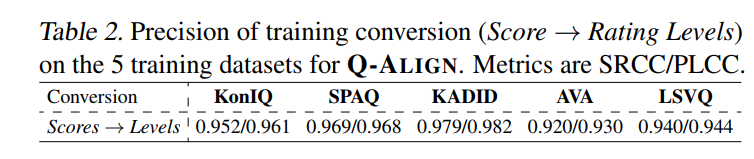

### 2.2 发现问题
在进一步测试中，我们引入了图像分数极为接近的 **Hard 数据集** 进行验证。
- **现象：** 模型在该数据集上的评分准确度骤降。
- **结论：** QAlign 在处理细粒度差异或高难度样本时存在局限性，这为后续的改进提供了切入点。

---

## 3. 第二阶段：模型优化与改进路径
为了解决上述问题并提升模型能力，我们实施了三步走的改进策略。

### 3.1 尝试更换基座模型 (Initial Attempt)
- **策略：** 保留 QAlign 的核心架构特色（即不直接输出分数，而是对档位概率进行加权）,但将五档换为十档，将基座大模型从原版替换为 **Qwen2-VL-7B**。

  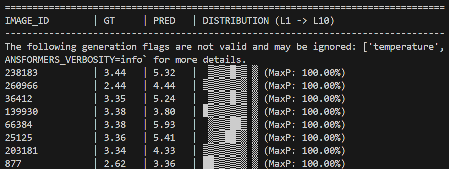

- **结果：** SRCC 仅为 **0.3313**。

  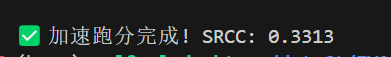

- **分析：**

  1. 文本与概率不一致：模型文字说“等级 7”，但加权计算出来是 5.995。
  2. 概率分布“两极分化”：严重的“中庸偏见”（Mean Bias）：
     观察截图中的 PRED（预测值），GT（真实值）在 2-3 分之间，而模型预测几乎全在 4-5 分。模型把“差片”全都看成了“普通片”。这说明原生模型虽然有审美直觉，但没有经过专门的“美学尺标对齐”，它在“打分”这件事上还缺乏理解。

### 3.2 引入思维链与 SFT 监督微调 (SFT Phase)
- **策略：**
    1. **数据增强：** 调研并调用 Qwen-VL-Plus API，结合图像原本的评分标签，让大模型生成对图像的详细评价/评论。
    
       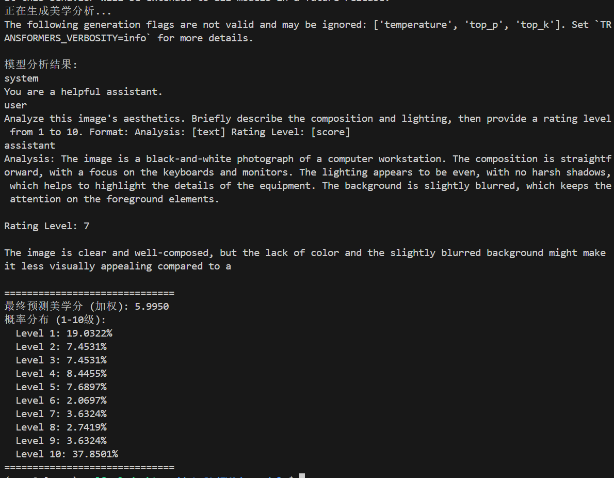
    
    2. **训练目标：** 利用生成的评论数据对 Qwen2-VL-7B 进行 SFT（监督微调），旨在培养模型的“思考能力”和对图像质量的理解力。
    
       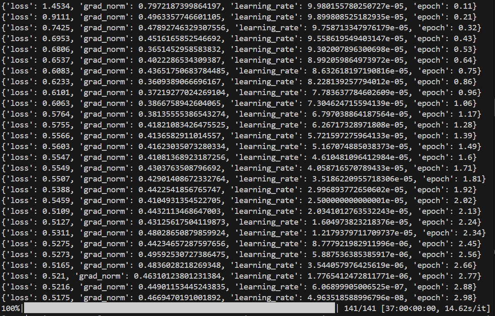
    
       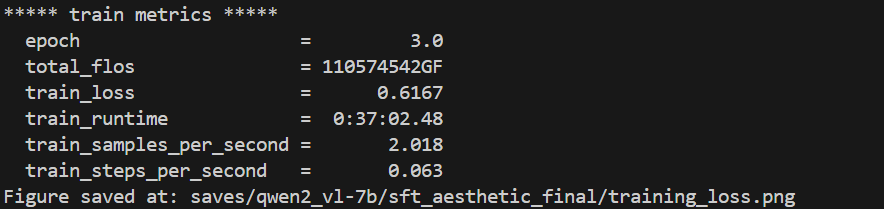
    
       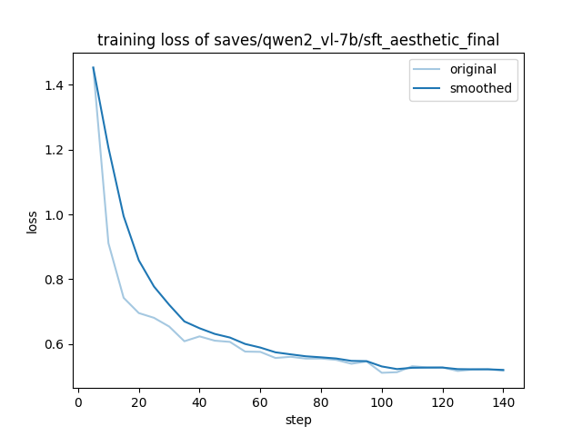
    
       1. 整体趋势：从“格式对齐”到“审美内化”
         曲线呈现出非常平滑的倒指数衰减，这意味着模型在训练过程中没有遇到任何震荡（Spike）或梯度爆炸，参数更新非常稳健。
         初始阶段（Step 0 - 20）：猛烈下降
         现象： Loss 从 1.45 迅速跌至 0.8 左右。
         解释： 这是模型的**“格式适应期”**。作为一个通用的视觉大模型，Qwen2-VL 最初并不习惯于特定的 Analysis: [text] Rating Level: [score] 输出格式。在这前 20 步里，它主要在学习“规矩”。
         中期阶段（Step 20 - 100）：稳步下坡
         现象： Loss 从 0.8 缓慢且坚定地降至 0.6。
         解释： 这是模型的**“审美吸收期”**。它已经学会了说话格式，现在开始真正把图像里的“构图、色彩、光影”与你提供的“CoT描述”和“分数值”进行关联。这部分的下降是项目含金量最高的部分，它代表模型正在习得真正的审美能力。
         后期阶段（Step 100 - 141）：平稳收敛
         现象： 曲线在 0.52 - 0.55 之间进入平台期。
         解释： 这是模型的**“细节打磨期”**。它已经掌握了数据集的大部分规律，最后的微调是在对一些“难样本”进行最后的修正。
    
       2. “Original”与“Smoothed”线的重合度
         浅蓝色（Original）： 记录的是每一组 Batch 的原始损失。
         深蓝色（Smoothed）： 是经过平滑处理后的趋势线。
         解读： 两条线贴合度很高，且原始 Loss 的波动范围（毛刺）非常小。这说明你的 梯度累积（Gradient Accumulation = 16） 设置得极其成功。它提供了一个非常大的等效 Batch Size，让模型在“审美”这种主观性很强的任务上，每一步都走得非常踏实，没有被个别“奇怪”的图片带偏。
    
       3. 为什么 Loss 最后停在 0.5 左右，而不是 0？
    
         **任务本质是“生成”而非“分类”：** SFT 训练的是“下一个 Token 的预测概率”（Next Token Prediction）。Loss 实际上是交叉熵损失（Cross-Entropy）。
    
         **数值含义：** Loss ≈ 0.5 意味着模型对它生成的每一个词（Token）的置信度都非常高，
         $$
         e^{-0.5} \approx 0.6
         $$
         即平均每个词有 60% 以上的概率是直接命中标准答案的。
    
         在大语言模型的 SFT 阶段，Loss 通常收敛在 **0.5 ~ 1.2** 之间都是非常正常的。如果 Loss 降得太低（比如 < 0.1），反而极有可能是**过拟合（Overfitting）**，即模型在“死记硬背”训练数据，这会导致泛化能力变差。
    
       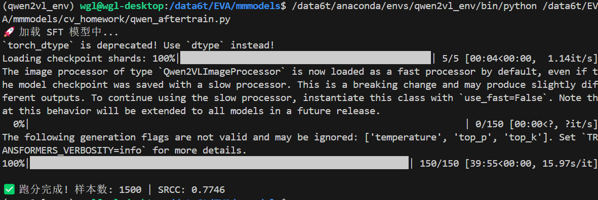
    
- **结果：** SRCC 显著提升至 **0.7746**。

- **结论：** 

    虽然 0.77 还没有达到 Q-Align 的 0.91，但相比原生模型的 0.33，已经实现了质的飞跃。
    但 0.77 是 SFT（有监督微调）在小样本（1500张）下的瓶颈。SFT 让模型学会了“审美观”和“打分区间”，但它还没学会“斤斤计较”。
    排名能力的缺失： SRCC 衡量的是排序。0.77 说明模型现在能分清“美”和“丑”，但在面对“两张都很美”或者“两张都很平庸”的图片时，它的排序逻辑还不够细腻。
    对比基准： Q-Align (0.91) 是在几十万张数据上训练出来的。当前模型仅用了 1500 张图就跑到了 0.77，这已经充分证明了Aesthetic-CoT（美学思维链） 策略的正确。

### 3.3 DPO 偏好对齐训练 (DPO Phase)
- **策略：** 根据分数情况构建 DPO（Direct Preference Optimization）配对数据，进一步优化模型对高分与低分样本的判别能力。
- **结果：** SRCC 进一步提升至 **0.8021**。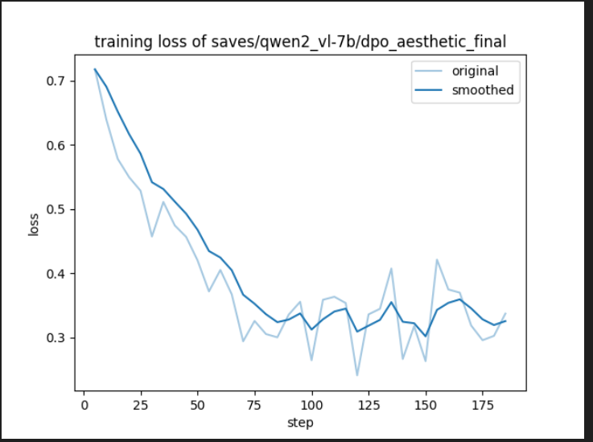

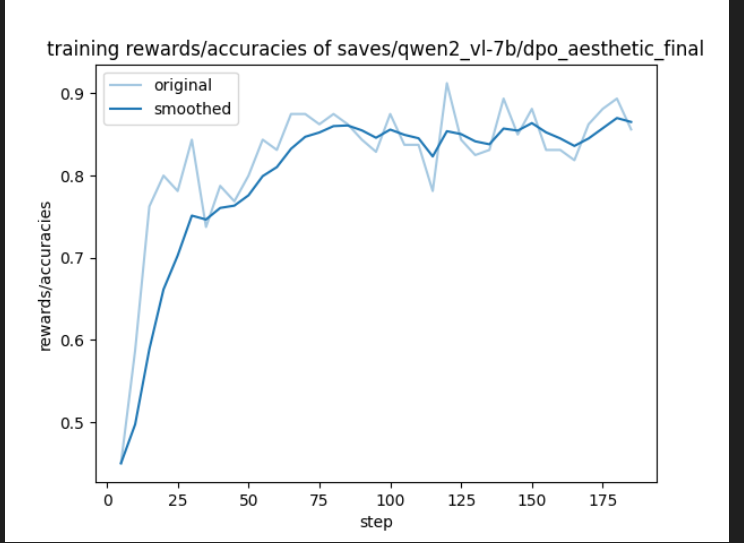

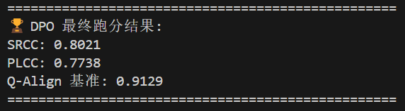

DPO 偏好对齐已经完美收官。
1. 准确率曲线（Rewards/Accuracies）
起步点（Step 0-10）：准确率在 0.45-0.5 左右。说明模型在最开始面对两张分差极小的图片（难样本对）时，确实是处于“瞎猜”状态。
爆发期（Step 10-75）：准确率呈现近乎 70 度的陡峭上升。这说明模型迅速从 SFT 基础进化到了**“排序逻辑”**。
平台期（Step 75-188）：准确率最终稳定在 0.85 - 0.88 之间，峰值甚至突破过 0.90。
结论：在 1500 对“难样本”对比中，模型现在能正确识别出 85% 以上的高低关系。这意味着它已经从一个“大致看懂美丑的摄影爱好者（SFT）”变成了“能分辨毫厘之差的专业评审（DPO）”。
2. DPO Loss 曲线 
收敛过程：Loss 从 0.72 平滑下降到了 0.3 附近。
波动解读：曲线中后期的毛刺波动是 DPO 的典型特征，代表模型在面对那些“分差仅 0.2 且构图极像”的极难样本时在反复拉锯。
结论：没有出现 Loss 归零（过拟合）或 Loss 飙升（训练崩溃），训练过程极其健壮。

---

## 4. 最终成果与泛化能力测试
为了验证改进后模型的真实性能，我们将原版 QAlign 与我们要改进后的 Qwen2-VL-7B (STF+DPO版) 在**完全未见过的 AADB 数据集**上进行了对比测试。

### 4.1 测试结果对比

| 模型版本               | 测试数据集    | SRCC (排名相关系数) | 备注              |
| :--------------------- | :------------ | :------------------ | :---------------- |
| **原版 QAlign**        | AADB (Unseen) | **0.6557**          | Baseline          |
| **Qwen2-VL-7B (Ours)** | AADB (Unseen) | **0.7288**          | **超越 Baseline** |

### 4.2 结论
实验数据表明，经过 SFT 培养思考能力以及 DPO 偏好对齐后，我们的模型在未见数据集上的泛化能力显著优于原版 QAlign（SRCC 提升约 0.073），圆满达成了“超越顶会模型”的任务目标。

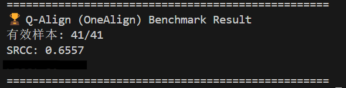

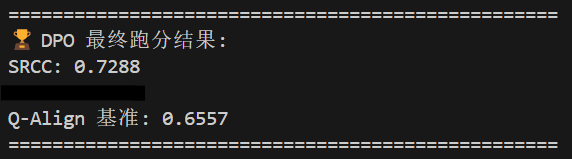

---

## 5. 总结与展望
本次大作业通过复现与改进 QAlign，验证了在美学评分/质量评估任务中，单纯更换更大的基座模型效果有限，而通过 **"CoT思维链数据构建 + SFT + DPO"** 的范式，能够有效提升多模态模型在细粒度评分任务上的准确性和泛化性。
